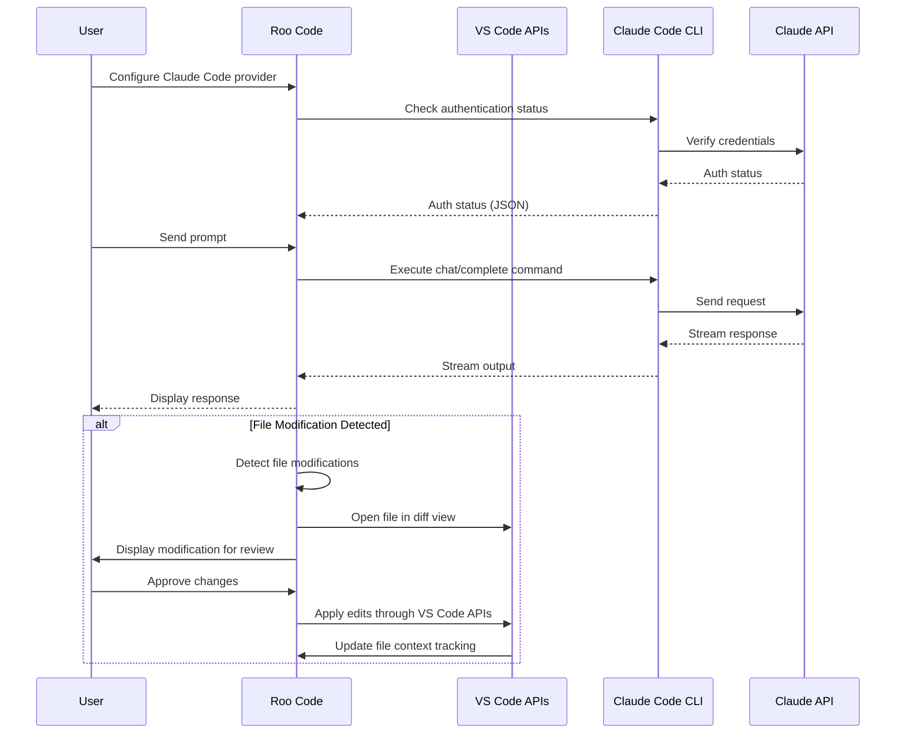

# Claude Code CLI Provider

This provider allows Roo Code to use the Claude Code CLI as a provider for accessing Claude AI models.

## Prerequisites

- [Claude Code CLI](https://claude.ai/code) installed and in your PATH
- Authentication configured (run `claude-code login` in your terminal)

## Technical Overview

## Configuration

In the Roo Code settings:

1. Select "Claude Code CLI" as the provider
2. Optionally specify the path to the Claude Code CLI executable
   - Leave blank if `claude-code` is in your PATH
   - Enter the full path otherwise (e.g., `/usr/local/bin/claude-code`)
3. Select a Claude model (Claude 3 Opus, Sonnet, Haiku, etc.)
4. For Claude 3.7 models, you can specify a thinking budget

## Authentication

1. The provider automatically checks authentication status
2. If not authenticated, you will be prompted to run `claude-code login`
3. Authentication status is cached during the session

## Features

- **Terminal Integration**: Communicates directly with Claude via the CLI
- **VS Code Integration**: Seamlessly integrates with VS Code's editor APIs
- **Streaming Responses**: Full streaming support for real-time responses
- **Thinking Support**: Captures thinking tags from Claude 3.7 models
- **Retry Logic**: Automatically retries on transient errors
- **Error Handling**: Helpful error messages for common issues
- **Path Validation**: Security checks for CLI path input
- **Model Selection**: Support for all Claude 3 models

## Advanced Features

### VS Code Integration

The Claude Code provider integrates with VS Code's native editor APIs:

- **File Operations**: File edits are routed through VS Code's workspace APIs
- **Diff View**: File changes are shown in VS Code's diff view for review
- **Tab Management**: Files being edited are properly opened in VS Code tabs
- **Context Tracking**: File operations are tracked to maintain context for the AI
- **Status Display**: Operations are shown with appropriate progress indicators
- **File Mentions**: File paths mentioned in responses are detected and tracked

This integration ensures consistent behavior with other providers and proper integration with VS Code's UI and functionality.

### Thinking Budget

For Claude 3.7 models, you can set a thinking budget to control how much internal reasoning the model will perform.

### Timeout Control

Long running operations have configurable timeouts to prevent hanging processes.

### Error Classification

The provider classifies different error types and provides targeted error messages:

- CLI not found errors
- Authentication errors
- Permission errors
- Timeout errors
- Network errors

## Troubleshooting

### Authentication Issues

If you encounter authentication problems:

1. Run `claude-code auth status` to check your auth status
2. Run `claude-code login` to re-authenticate
3. Verify that your session is active by running `claude-code chat`

### CLI Not Found

If the CLI can't be found:

1. Check that Claude Code CLI is installed
2. Ensure it's in your PATH or provide the full path in settings
3. Verify permissions (should be executable)

### Timeout Errors

If you encounter timeout errors:

1. Check your network connection
2. Try again later (could be service issues)
3. For large prompts, consider breaking them into smaller chunks

## Examples

### Basic Usage

Using the Claude Code provider is straightforward:

1. Select "Claude Code CLI" as the provider in Roo Code settings
2. Start a new conversation
3. Your messages will be sent to Claude via the CLI

### Advanced Usage: Models

You can select different Claude models depending on your needs:

- **Claude 3 Opus**: Highest quality, best for complex tasks
- **Claude 3 Sonnet**: Good balance of quality and speed
- **Claude 3 Haiku**: Fastest, good for simple tasks
- **Claude 3.7 Sonnet**: Access to thinking capability

## Technical Details

### VS Code Integration Architecture

The provider uses a wrapper architecture to integrate with VS Code:

- **File Operation Interception**: Detects when Claude Code modifies files
- **Diff Workflow Integration**: Routes changes through VS Code's diff view
- **Status Display**: Shows operations in the Roo UI with progress indicators
- **Context Tracking**: Maintains file context for better AI awareness
- **Path Resolution**: Resolves relative and absolute paths consistently
- **File Mention Detection**: Heuristically detects file mentions in responses

### Security Considerations

- CLI path input is validated to prevent command injection
- No sensitive information is passed in command arguments
- Stdin is used for passing message content
- File paths are validated before operations

### Error Handling and Retry Logic

The provider implements:

- Exponential backoff with jitter for retries
- Classification of retryable vs. non-retryable errors
- Comprehensive error messages for different failure modes

### Process Management

- Timeouts prevent hanging processes
- Process resources are properly cleaned up
- Stderr is monitored for error conditions
- VS Code operations are properly coordinated with CLI operations

### Testing

The provider has comprehensive test coverage:

- Authentication testing
- Command execution
- Error handling
- Retry logic
- Path validation
- XML processing for thinking tags
- VS Code integration
- File operation interception
- Diff view interaction
- Context tracking